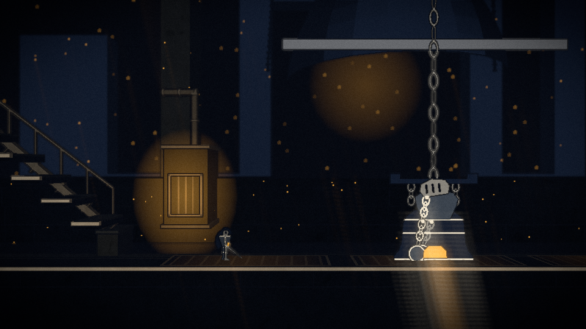
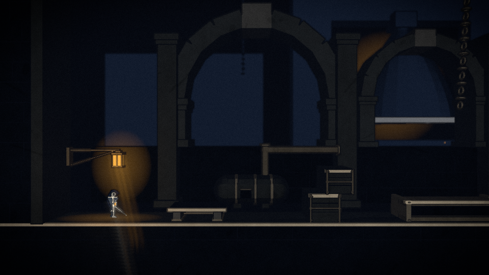
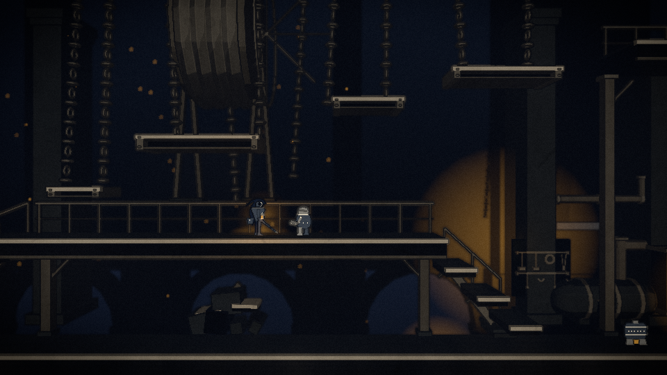
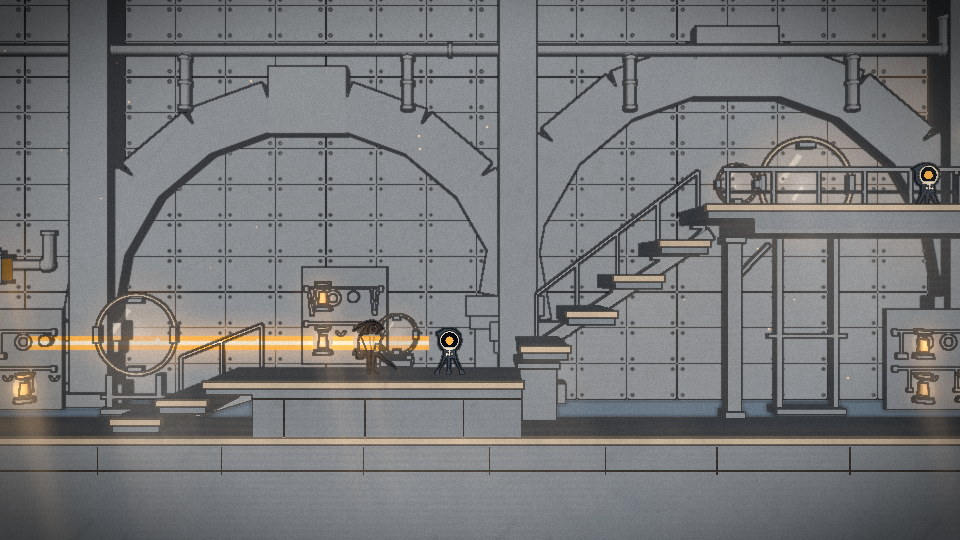
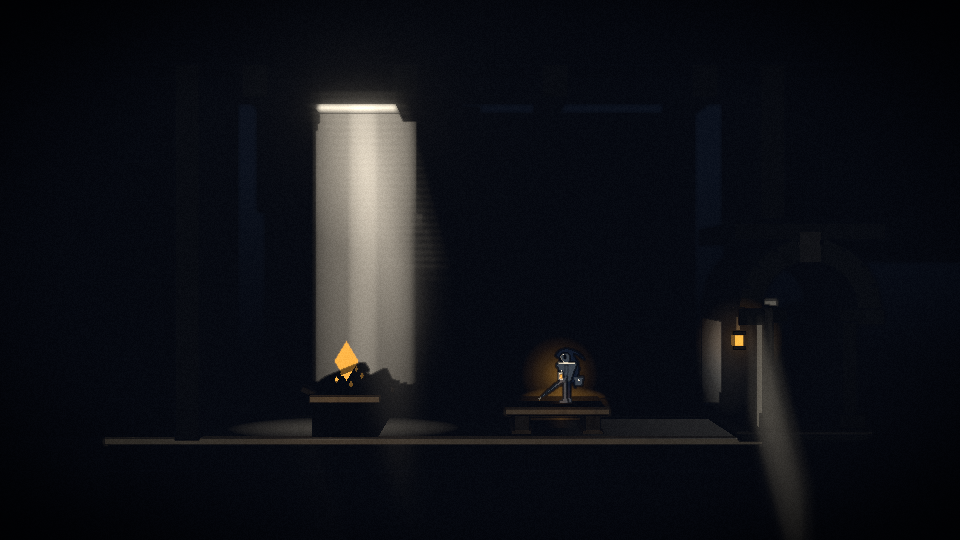

# Borrowed Dawn

**Steal the sunrise from the machines that hoard it.**

Play it: https://jbotoro.github.io/borrowed-dawn/

A Hollow Knight-adjacent side-view action game in Three.js, built in a two-day hackathon by directing AI coding agents.



## The game

You are a municipal lantern courier. The mountain towns stored their daylight inside a network of furnaces and glass engines during the ash winter, and now that the sky has cleared the machines still follow the old emergency order: preserve the reserve, refuse every withdrawal. Climb the ignition station, put down the Bellkeeper that guards it, and open the vault where the light is kept.



### Areas

- **Cinder Landing**: the safe entry, with the checkpoint lamp on its bracket and the great door to the bell chamber sealed, furnace light coming through the bars.
- **Chain Gallery**: the hoist hall where the bells were raised, a shop floor and a service stair up to a mezzanine under the winch, with hung planks climbing higher still.
- **Wick Cache**: the wick store off the gallery landing, entered by breaking through a bricked doorway; the Longwick sits on a rack under an amber lamp.
- **Ember Vault**: a hidden room behind a false wall in the Gallery that only fades when your lantern comes close.
- **Belfry**: the bell chamber and the boss arena; the shortcut gate back to the Landing opens as you approach, so a death never costs you the Gallery again.
- **The Reserve**: past the Belfry's right wall once the Bellkeeper is dead, where the hoarded light actually lives, pale porcelain and glass instead of dark iron.
- **The Lens Hall**: one room deeper, tiered platforms and lenses the beams pass through, with the Dawn Core at the far end.
- **The Sunwell**: a dark stone shaft off the Landing behind an iron sun-shutter that only opens after the kill, holding one real sunbeam.



### Enemies

- **Cinder Guard**: patrols a fixed stretch, leans back and lifts its cleaver overhead with the visor slit going vermilion, then lunges; the recovery is your window. Three hits.
- **Boiler Stomper**: a riveted drum on block feet that squashes and ramps its underglow from amber to vermilion before it hops, landing with floor ridges that travel out along the ground. Two hits.
- **Lamplighter**: a brass hanging lamp that never touches the floor; it leans toward you and its window goes vermilion, then it drops a falling ember. Two hits.
- **Prism Sentry**: a glass eye on an iron tripod, fixed in place, whose iris brightens through a charge before it fires a beam along its own row. Three hits.
- **The Bellkeeper**: a bell shell on a yoke over a furnace mouth with one clapper arm, alternating a clapper sweep and a furnace stomp chosen by seeded RNG so it never repeats three times, and cracking open into a faster phase at half health. Twenty-four hits.

### Loot

The **Longwick** in the Wick Cache lengthens your reach and leaves your damage alone. Two **Ember Flasks**, one in the Ember Vault and one in the Sunwell, each add a health pip. The **Dawn Core** at the end of the Lens Hall is the run's payoff.

### Controls

Arrows or WASD move, Z or Space jump, X or J attack, C or Shift dash, up or down plus attack for a vertical swing, Esc pause, Enter to start or restart. The tuning panel opens with the backquote key and changes every number live.

Debug params: `?autoplay=1&seed=42` runs the scripted bot, `?screenshot=1` hides the HUD and the panel, `?fast=4` scales time, `?room=belfry` starts in a room, `?start=demo` at the demo start, `?god=1` takes no damage.

## How it looks and why

The look is graphic near-monochrome: five values from void through charcoal, slate, and ash to porcelain, with amber and vermilion as the only chroma on screen. Colour is meaning, not decoration. Amber is stored light, safety, and reward. Vermilion is threat and nothing else, so an enemy that has committed to an attack is the only red thing in the frame.

Actors are tin puppets. Every figure is built from flat extruded silhouettes layered a few millimetres apart on pins, with an unlit material, so a character is a silhouette by definition and no light can leak out of a body. Shading comes from which layer a plate sits on, never from a lamp. Motion is articulation at the pins, driven by the same pose code that drove the earlier solid meshes.

The render pass is procedural and runs in one composer chain: a duotone tint with cool shadows and warm light, canvas-drawn stone and iron textures inside the value ramp, a screen-space ink line instead of outline geometry, light shafts from the bright regions, depth of field on the far layers, and film grain. Every shader constant is a tuning key, and quality degrades through one key if frame time slips.

Rooms are buildings, not obstacle courses. A room reads left to right in the direction of travel as a place a worker would walk, stairs rise toward the destination, every platform stands or hangs on something visible, branches are clearly optional, and the exit is the one opening with light in it. Killing the Bellkeeper flips the world into a dawn state: the ambience warms, sealed doors open with light behind them, and two rooms that were shut become reachable.




## How it was built

**Stack.** three 0.186 with `WebGLRenderer`, `EffectComposer`, and a custom post chain; TypeScript strict; Vite 8; Vitest; lil-gui; howler. Node 24. Every mesh, texture, and effect is procedural geometry and code. Nothing is imported or generated: no models, no sprites, no images. One open-license web font is the single external asset.

**Architecture.** `src/game/` is the pure simulation on a fixed timestep with no three import anywhere in it, split into physics, player, enemies, boss, hazards, combat, rooms, and progress against a contract in `types.ts`. `src/render/` is the only place three appears, plus the boot in `src/main.ts`. `src/content/` holds the rooms as data (solids, doors, enemies, pickups, gates, breakables, decor, bot waypoints) and the strings. `src/tuning.ts` holds every gameplay and feel number in the game, bound live to an in-game panel that persists overrides to localStorage; nothing else hard-codes a number, and a new number means a new key. `src/audio/` is a howler wrapper over procedural WebAudio beds and SFX. `src/debug/` is the autoplay bot and the query params.

**The loop.** One person directs and playtests; agents write the code. Claude did the design and the implementation, Codex did reviews and some of the simulation work, and each slice went to a fresh agent with a written contract naming its files. No agent was allowed to claim a visual or feel change worked without opening the running game in a browser through the Chrome DevTools MCP, taking a screenshot, and reading the console. Numbers were changed in the tuning panel during play and only then written back as defaults. Vitest covers the simulation only, 80 tests; everything visual is verified by looking. Every milestone gate ran a full review of the diff since the last tag before anything was frozen.

**Milestones.** `m1-skeleton` was the first morning's fixed-camera arena survivor, retired the same day. `m2-skeleton` was the side-view game with four rooms, the boss, and the checkpoint loop. `m3-visual` was the whole game rebuilt under the look. `m4-final` is the demo build at the root. The three earlier ones are frozen and still playable under `/builds/<tag>/`, `m1-skeleton` included, as evidence of the path not taken.

## Why

**Why not the arena survivor.** The first build of day one was a fixed-camera arena survivor, and it worked. It was retired at 10:20 that morning because a colleague had shipped a survivor clone at the previous hackathon, and because a 2D arcade game is a solved problem for coding agents: it would not have shown anything about what they can do now. A side-view action game with a real boss, a place to explore, and a coherent look was the harder thing to attempt in the time.

**Why procedural art.** The rule was no sourced or generated assets, which meant the agents had to construct the visual direction themselves rather than shop for it. That turned art into an engineering problem with a written specification, a value ramp, a construction rule for actors, and an acceptance test per slice, which is something agents can iterate on, screenshot, and be corrected on.

**Why tells instead of hitboxes.** An early version drew the threatened area as a filled vermilion rectangle. It read as a rendered hitbox and removed the challenge: you were reading UI, not reading a creature. Every telegraph fill was cut, and the warning now lives in the pose, the glow, and a sound per enemy, which is the soulslike reading the genre is built on.

**Why level 2 is one area deeper.** The obvious reward for a boss kill is a new place. A new place one room over would have meant a new kit, and the version that tried it read as overhead lighting in an unrelated building. The Reserve and the Lens Hall keep the iron kit and change the key, the light sources, and the palette instead, so they read as the same building further down, which is both cheaper and truer to the fiction.

## Running it

```
npm install
npm run dev        # http://localhost:5173/borrowed-dawn/
npm run check      # typecheck, tests, autoplay route check
npm run build
npm run snapshot -- m4-final   # freezes a build under public/builds/<tag>/
```

Node 24 (see `.tool-versions`).

## Status and known limits

- The game has been played end to end and the gates were checked by hand, but it has only ever been verified at 720p-class sizes on one machine. High-DPI behaviour is unknown.
- In the two level 2 rooms, doors sit close to the screen edge and can read dim on entry. The levers for it (camera padding, vignette) were identified and not pulled.
- No agent ever heard the audio. The music beds and SFX are procedural WebAudio verified by reading code and by one human listening pass; the per-item listening checklist was never filled in.
- The repository folder is still named `one-more-run`, the working title. The package, the Vite base, the storage key, and the deployed URL are all `borrowed-dawn`.
